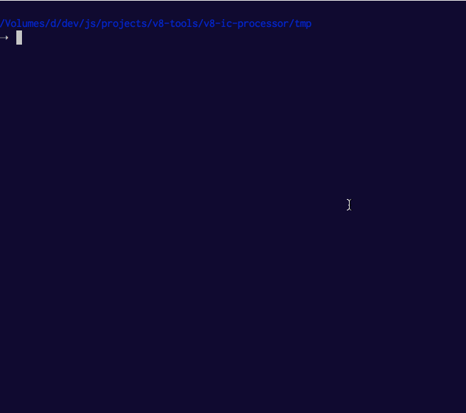

# v8-ic-processor

Processes and visualizes IC (inline cache) information collected for functions in your application

Derived from the one included with [v8/tools](https://github.com/v8/v8/tree/master/tools).

## Installation

    npm install v8-ic-processor

## Usage

Run `d8` or `node` with the `--trace-ic` flag to produce a `v8.log` or `isolate-0x...-v8.log`
respectively.

Then run `v8-ic-processor` to open any or all of the logs now found in the current directory.
